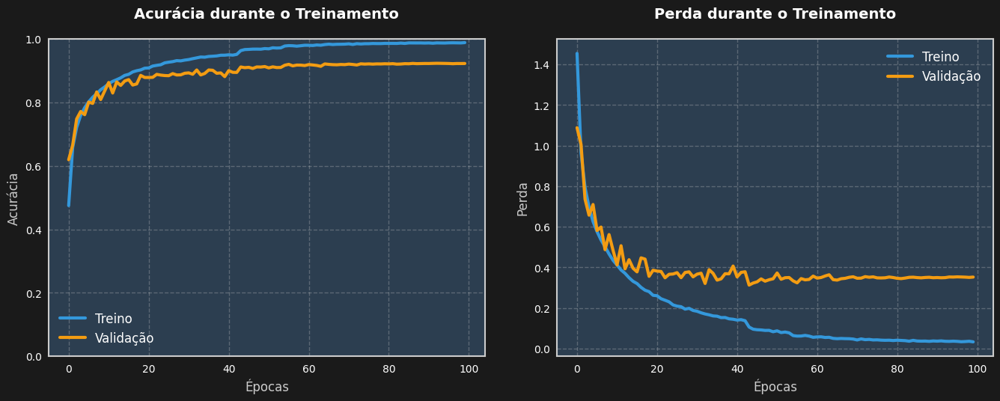

# Classificador CIFAR-10: Média 0.9559

Bem-vindo ao repositório do **Classificador CIFAR-10**, um projeto de visão computacional que alcançou a **média 0.9559** (`(accuracy + val_accuracy) / 2`) em uma competição acadêmica, garantindo o primeiro lugar! Este modelo, treinado no dataset CIFAR-10, classifica imagens 32x32 em 10 classes (avião, carro, pássaro, gato, cervo, cachorro, sapo, cavalo, navio, caminhão) com alta precisão.

## 📖 Sobre o Projeto

O objetivo foi desenvolver uma rede neural convolucional (CNN) para classificar imagens do CIFAR-10, maximizando a média entre a acurácia de treinamento e validação. O projeto foi implementado em **TensorFlow** e otimizado no **Google Colab** com GPU, usando técnicas avançadas de aumento de dados e regularização.

### Resultados
- **Acurácia de Treinamento**: 0.9889
- **Acurácia de Validação**: 0.9228
- **Média**: 0.9559
- **Top-5 Acurácia**: ~0.998–1.00
- **Épocas**: 100
- **Tempo de Treinamento**: ~50 min (GPU T4)



## 🛠️ Técnicas Utilizadas

- **Arquitetura CNN**:
  - Camadas convolucionais com filtros (64, 128, 256).
  - Camadas densas (512, 256) com `Dropout` (0.35).
  - Ativação `gelu` e `BatchNormalization` para convergência rápida.
  - Saída com 10 classes (logits).

- **Aumento de Dados**:
  - `RandomFlip`, `RandomRotation` (~3°), `RandomZoom` (97%–103%).
  - `random_brightness` (0.05), `random_contrast` (0.95–1.05).
  - CutMix simplificado (90% de probabilidade) para melhorar generalização.

- **Otimização**:
  - Otimizador `AdamW` (`learning_rate=0.0015`, `weight_decay=1e-4`).
  - `EarlyStopping` (paciência=12) e `ReduceLROnPlateau` (fator=0.5, `min_lr=1e-6`).
  - `mixed_precision` para eficiência na GPU.

- **Pipeline**:
  - `tf.data` com `cache`, `shuffle` (buffer 8192), e `prefetch` para desempenho.
  - Dataset de validação completo (10.000 imagens de teste).

## 📂 Estrutura do Repositório

```
├── cifar10_model.keras                   # Modelo treinado
├── optimized_cifar10_colab_top5_v5.ipynb # Código principal de treinamento em .ipynb
├── optimized_cifar10_colab_top5_v5.py    # Código principal de treinamento em .py
├── predict.py                            # Script para previsões
└── training_metrics.png                  # Gráficos de acurácia e perda
```

## 🚀 Como Usar

### Requisitos
- Python 3.8+
- TensorFlow 2.10+
- NumPy, Matplotlib

Instale as dependências:
```bash
pip install tensorflow numpy matplotlib
```

### Treinar o Modelo
1. Clone o repositório:
   ```bash
   git clone https://github.com/IrvinMoura/IA-CFAR10.git
   cd IA-CFAR10
   ```
2. Execute o código de treinamento:
   ```bash
   python optimized_cifar10_colab_top5_v5.py
   ```
3. O modelo será treinado no CIFAR-10, e os gráficos serão salvos como `training_metrics.png`.

**Nota**: Recomenda-se usar Google Colab com GPU para melhor desempenho.

### Fazer Previsões
Use o modelo treinado para classificar novas imagens:
1. Execute o script de previsão:
   ```bash
   python predict.py
   ```
2. Substitua `teste.jpg` no script por sua imagem (32x32, RGB).

Exemplo de `predict.py`:
```python
from tensorflow.keras.models import load_model
import numpy as np
from PIL import Image
import matplotlib.pyplot as plt

model = load_model('cifar10_model.keras')
classes = ['avião', 'carro', 'pássaro', 'gato', 'cervo', 'cachorro', 'sapo', 'cavalo', 'navio', 'caminhão']

img = Image.open('teste.jpg').resize((32, 32))
img_array = np.array(img).astype('float32') / 255.0
img_array = np.expand_dims(img_array, axis=0)

predictions = model.predict(img_array)
predicted_class = np.argmax(predictions[0])
probabilities = tf.nn.softmax(predictions[0]).numpy()

print(f"Classe prevista: {classes[predicted_class]}")
for i, prob in enumerate(probabilities):
    print(f"{classes[i]}: {prob:.4f}")

plt.imshow(img)
plt.title(f"Previsão: {classes[predicted_class]}")
plt.axis('off')
plt.show()
```

## 📊 Visualização dos Resultados

Os gráficos de acurácia e perda mostram a evolução do treinamento:

- **Acurácia**: Treinamento (azul) e validação (laranja).
- **Perda**: Treinamento (azul) e validação (laranja).


## 🙌 Contribuições

Sinta-se à vontade para abrir *issues* ou enviar *pull requests* com melhorias, como:
- Novas técnicas de aumento de dados.
- Otimizações na arquitetura.
- Scripts adicionais para visualização.

## 📧 Contato

Para dúvidas ou sugestões, entre em contato:
- GitHub: [IrvinMoura](https://github.com/IrvinMoura)
- LinkedIn: [IrvinMarques](https://www.linkedin.com/in/irvinmarques/)
- Email: irvinmoura27@gmail.com

---